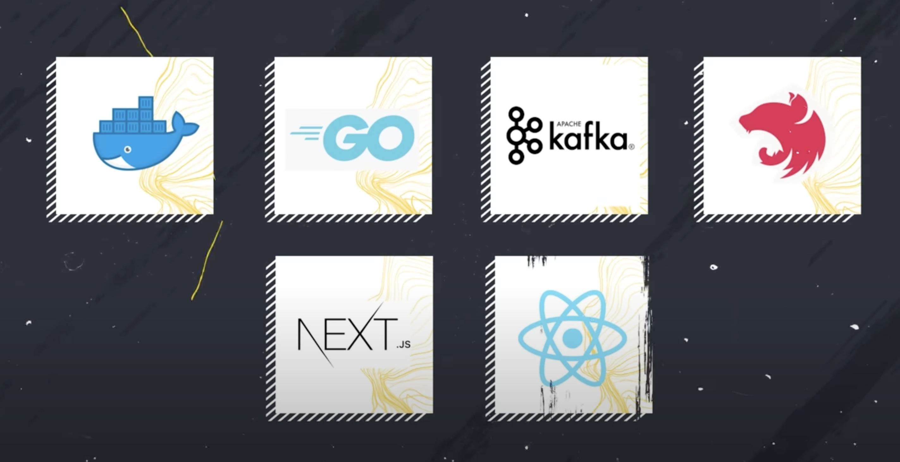
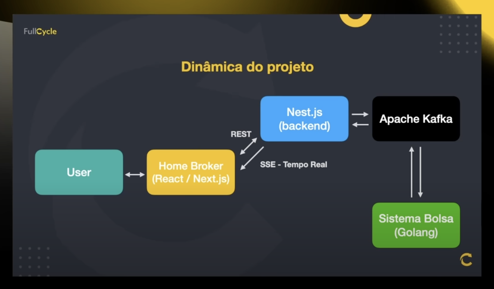
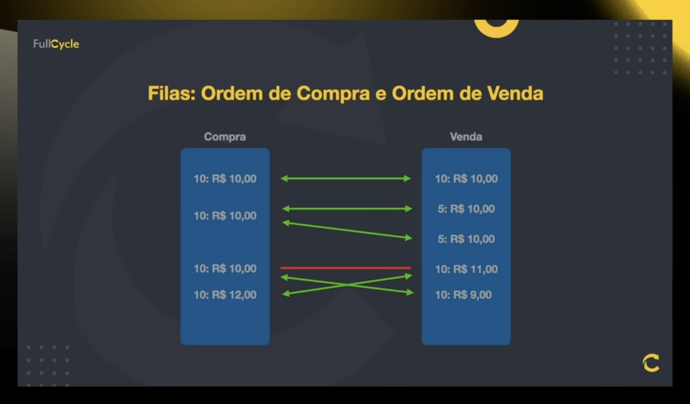
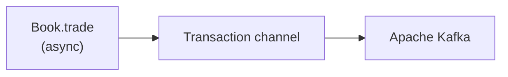

# fullcycle-imersao13

Treinamento com as aulas gratuitas da imersão no Youtube

  

# Tecnologias

- Docker
- Linguagem Go
- Next.js
- Nest.js
- Apache Kafka
- SSE (Server Sent Events)

  

# Agenda

- Entender o projeto prático
- Tecnologias que serão utilizadas
- Ordem do desenvolvimento
- Entendimento do microsserviço de "bolsa"
- Inicio do microsserviço de "bolsa"

  

# Projeto prático

**Desenvolveremos uma plataforma de investimentos com Home Broker:**

- Sistema da Bolsa (Simular uma B3 - Dar Match de ofertas de compra e vendas de ações)
- Home Broker onde as ofertas serão submetidas, além dos indicadores em tempo real

  

# Ordem do desenvolvimento

- Dia 1: Criação do microsserviço de bolsa com seu principal algoritmo funcionando.
- Dia 2: Adoção do Apache Kafka ao microsserviço de bolsa para enviar e receber as ordens
- Dia 3: Desenvolvimento do backend (Nest.js) do Home Broker
- Dia 4: Desenvolvimento do frontend (Next.js) do Home Broker
- Dia 5: Integração do Frontend e Backend e ajustes finos

  

# Recomendações

- Assista as lives do "esquenta"
  - Falamos sobre: Docker, Go, Kafka, Nest.js e Next.js
  - Encontram-se no canal do YouTube: YouTube.com/fullcycle

  

# Complexidades do microsserviço de "Bolsa"

- Simulador da bolsa possui um algoritmo ligeiramente complexo para fazer o match das ordens de compra e venda
- Simulador precisa ser performático
- Precisará trabalhar com as operações "in memory"
- Principais alocações precisarão ficar na heap e não na stack

  

# Microsserviço de "Bolsa"

- Cada vez que uma ordem de compra e venda dão “match”, geraremos uma transação.
- Essa transação será publicada no Apache Kafka no formato JSON
- Não utilizaremos banco de dados por conta de tempo e simplificação
- Sim, se o processo morrer, perderemos transações (lembrando estamos simplificando)

  

# Microsserviço de "Bolsa" - Channels

- Quando um "match" ocorre, uma "transaction" é gerada e enviada a um channel de output que será lido pelo Apache Kafka

